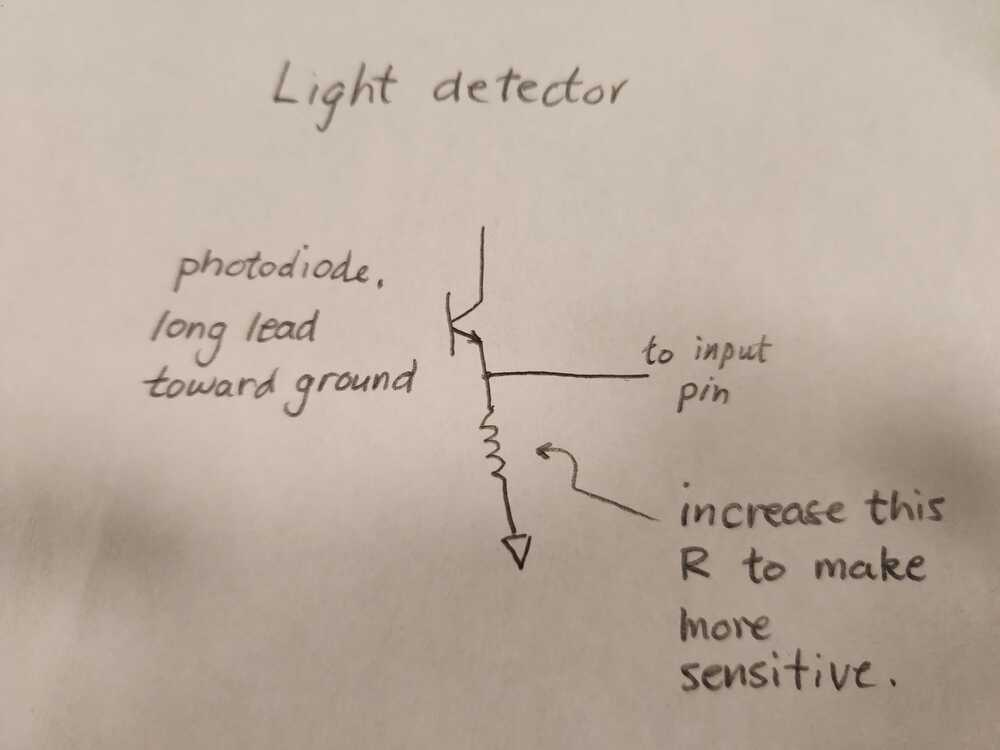
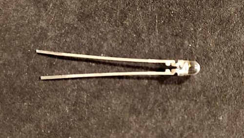

# Input Device:  Phototransistor for light detection.

A phototransistor conducts current when exposed to light.  The voltage at the "top" of the resistor increases when there is current in the circuit. 

The output is connected to an input pin.  If the pin is set as a digital input pin, it detects high or low voltage.  If the pin is set as an analog to digital converter (ADC) it reads the voltage level.

  

<figure>
  
  <figcaption>Light detection circuit.</figcaption>
</figure>

<figure>
  
  <figcaption>Phototransistor - long pin toward lower voltage..</figcaption>
</figure>

  

<figure>
  
  <figcaption>Phototransistor on breadboard attached to a pin of a microcontroller module.</figcaption>
</figure>

