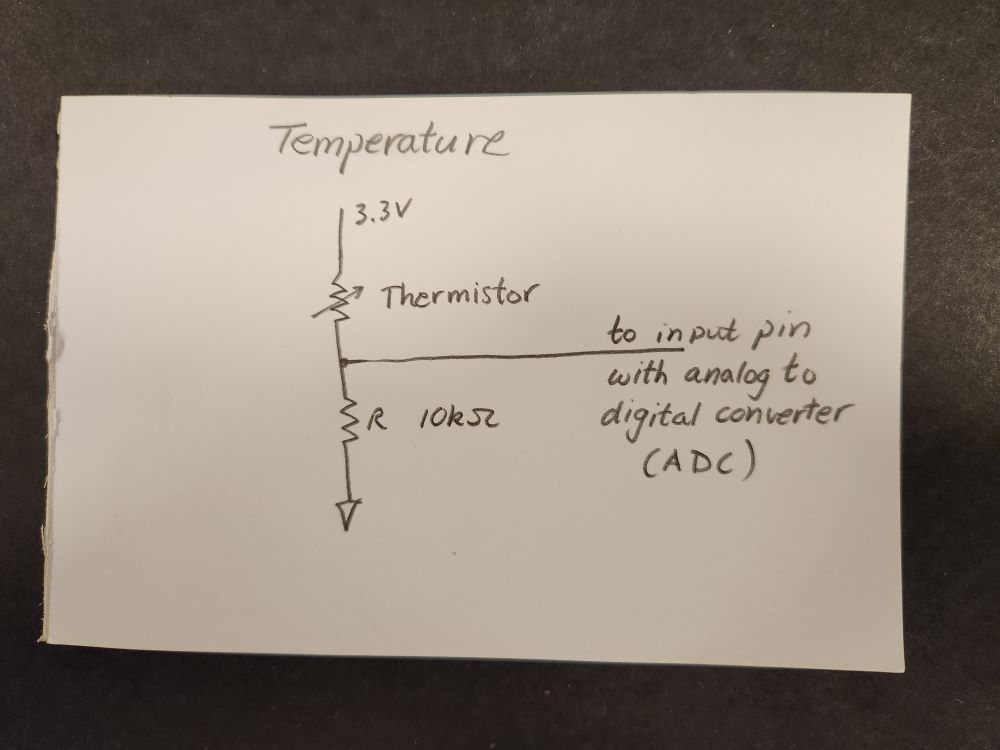
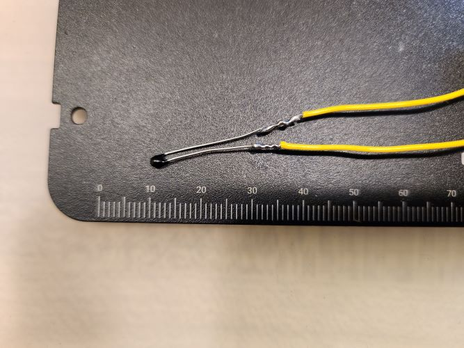
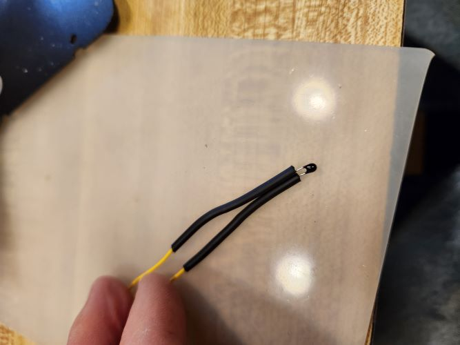
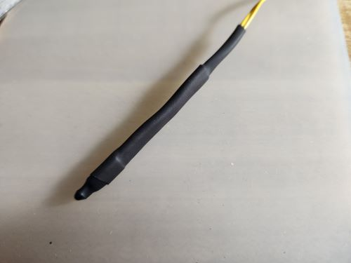

# Input Device to measure temperature:  Thermistor.

A thermistor is a temperature-dependent resistor.  It is attached in series to another resistor, a configuration called a voltage divider.  When its temperature changes, the voltage between the two resistors changes.

The voltage at the middle of the voltage divider is read by one of the microcontroller pins that is capable of analog to digital conversion (ADC).  It reports voltages as numbers in the range 0 - 65536 (2 to the power 16).

  

<figure>
  
  <figcaption>Thermistor circuit.</figcaption>
</figure>

  

<figure>
  
  <figcaption>Thermistor circuit on a breadboard attached to a pin of a microcontroller module.</figcaption>
</figure>

### Measuring temperature.

Here is one way to use the thermistor to make a practical thermometer that can be put in water.  First, solder wire leads to the thermistor wires.

<figure>
  
  <figcaption>Thermistor soldered.</figcaption>
</figure>

Cover the leads in heat shrink tubing to protect from shorting together.
 

<figure>
  
  <figcaption>Thermistor leads with shrink tube.</figcaption>
</figure>
 

Encase the first few cm in more shrink tube, and seal the bead with epoxy to keep water out.

<figure>
  
  <figcaption>Thermistor encased in shrink tube with epoxy on the tip.</figcaption>
</figure>

