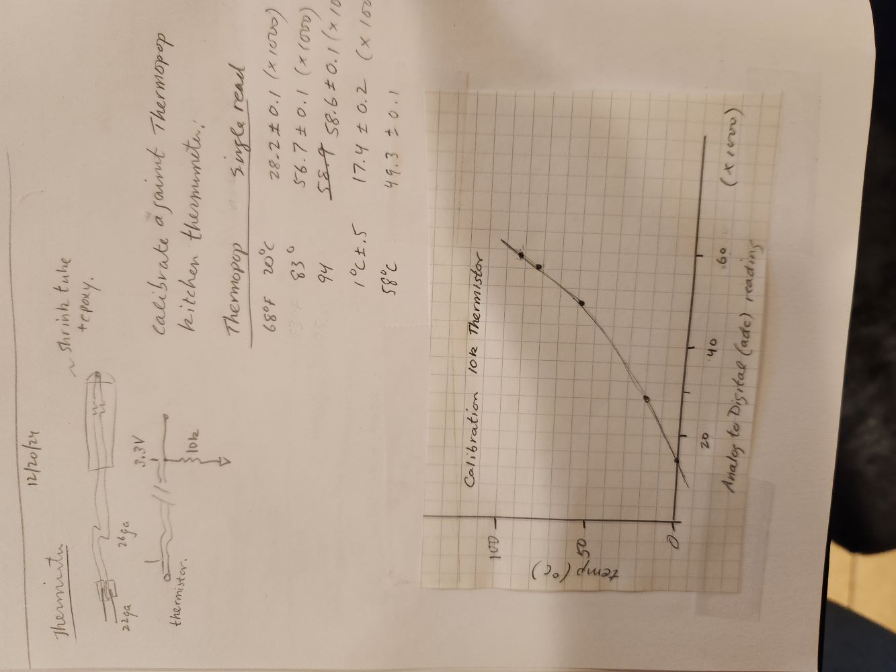

# Input Device to measure temperature:  Thermistor.

A thermistor is a temperature-dependent resistor.  It is attached in series to another resistor, a configuration called a voltage divider.  When its temperature changes, the voltage between the two resistors changes.

The voltage at the middle of the voltage divider is read by one of the microcontroller pins that is capable of analog to digital conversion (ADC).  It reports voltages as numbers in the range 0 - 65536 (2 to the power 16).

  

<figure>
  
  <figcaption>Thermistor circuit.</figcaption>
</figure>

  

<figure>
  
  <figcaption>Thermistor circuit on a breadboard attached to a pin of a microcontroller module.</figcaption>
</figure>

### Measuring temperature.

Here is one way to use the thermistor to make a practical thermometer that can be put in water.  First, solder wire leads to the thermistor wires.

<figure>
  
  <figcaption>Thermistor soldered.</figcaption>
  <figcaption>Thermistor leads with shrink tube.</figcaption>
</figure>

  

Cover the leads in heat shrink tubing to protect from shorting together.

<figure>
  
  <figcaption>Thermistor leads with shrink tube.</figcaption>
</figure>

  

Encase the first few cm in more shrink tube, and seal the bead with epoxy to keep water out.  If I wanted to make this a more reliable setup, I could get rid of the breadboard, and solder wires and resistors directly to the microcontroller module.  Then I could make an enclosure to keep it all safe.  Maybe even incorporate a display and a battery to make it portable.  See the OLED in the kit as a possible device for displaying results.

<figure>
  
  <figcaption>Thermistor encased in shrink tube with epoxy on the tip.</figcaption>
</figure>
  

Set up to calibrate thermistor.  Thermistor and kitchen thermometer are near each other in water in an insulated cup.  Make sure that readings on both are stable.  Take note of uncertainty.  For Thermopop thermometer, it looks like +/- 1 degree.  For adc reading, about 100 units.  
<figure>
  
  <figcaption>Calibration setup.</figcaption>
</figure>
  

Here are some results.  I could have calculated the resistance, using the voltage divider equation, and plotted that, but instead chose to plot the raw data vs temperature.  I like to plot the two measured things together, to get a sense of error bars.  On the plot, the thermometer error bars are about the size of the dots, but the error on the adc reading is about ten times smaller!  Could get much more precise calibration with a better reference. 

As expected, the relationship between temperature and voltage is not linear.

<figure>
  
  <figcaption>Notes and plot of calibration data.</figcaption>
</figure>
  

How could I turn the adc data into a temperature?  Depends on how precise I want to be.  I could:
* Do a linear fit over whatever range of temperature I'm most interested in, and live with whatever inaccuracy that gives.
* Do a fit to a more complex equation, like a quadratic or cubic.
* Find a mathematical model for the resistance as a function of temperature and use that, checking at some points (like 0 and 100 Celcius).

You can find a [mathematical model](https://eepower.com/resistor-guide/resistor-types/ntc-thermistor/#) for the resistance as a function of temperature, and look at the [datasheet](https://www.cantherm.com/wp-content/uploads/2017/05/cantherm_mf52_1.pdf) for the thermistor to get the required constants for the equation.  There are tutorials like [this one from Sparkfun](https://www.circuitbasics.com/arduino-thermistor-temperature-sensor-tutorial/) on how somebody thinks it should be done.  The bottom line is that you need to make sure by measuring that your thermometer is doing as well as you need it to do!

