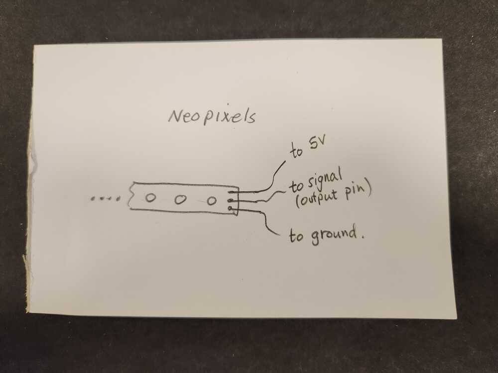
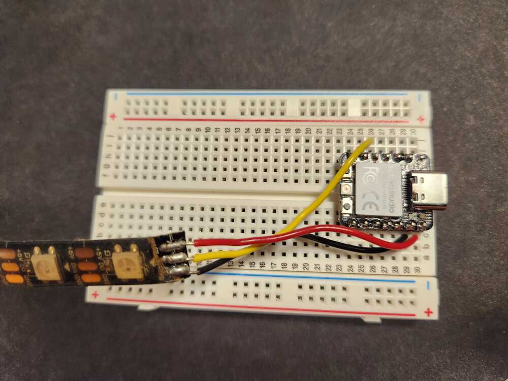

# Output device:  Neopixel LED strips.

These are the strips of RGB LEDs that you see everywhere.  They are 
controlled by using a library that is built into micropython, called 'neopixel'.  Once the pixel array is initialized, the pixels are addressed as elements of a list.  The LEDs on the strip each have their own small control unit that accepts coded messages through the signal wire (yellow for these strips).  The signals are created by turning the output pin high and low at specified times.  More information than you could ever need is on the [Adafruit site](https://learn.adafruit.com/adafruit-neopixel-uberguide?view=all&gad_source=1&gclid=Cj0KCQiA0--6BhCBARIsADYqyL-kg2_bHbOH_j5xzndaKC5v-NMp_CucoSRIsnyQKTGTvXvgRJN6QywaAs6mEALw_wcB).

The Neopixel strips are powered by the 5V pin on the microcontroller.  If more current is needed, strips can be powered from an external 5V source, but don't exceed 5V, or you'll destroy the LEDs.
  

<figure>
  
  <figcaption>LED equivalent circuit.</figcaption>
</figure>

  

<figure>
  
  <figcaption>Neopixel strip on breadboard attached to ground, 5V, and an output pin.</figcaption>
</figure>

