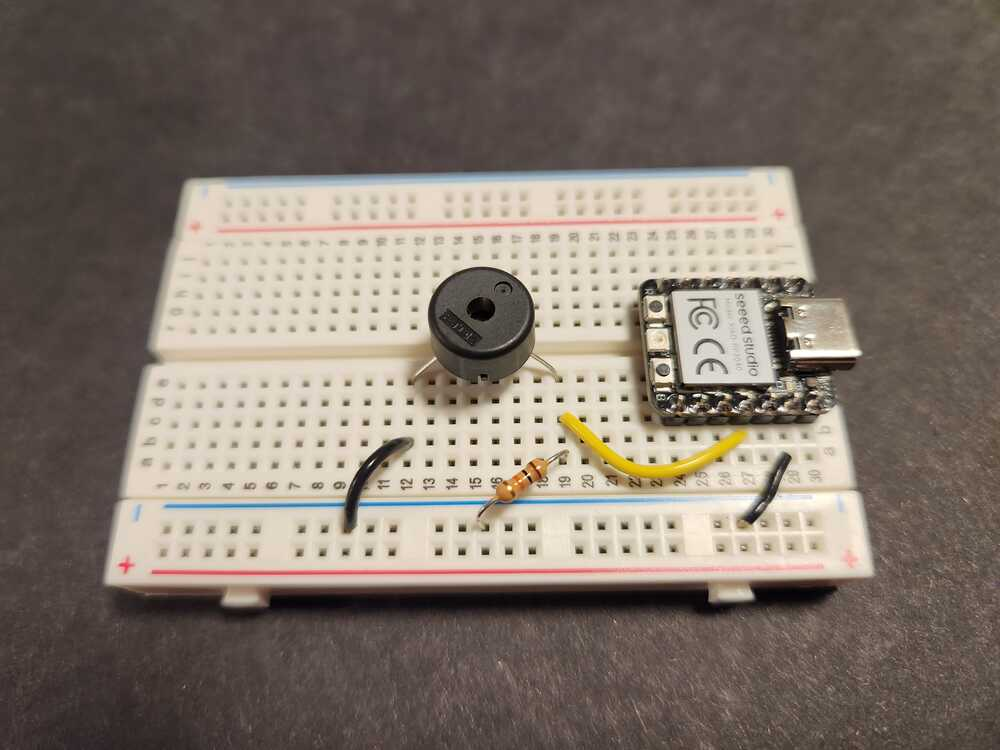

# Output Device:  Buzzers for making obnoxious sounds.

These buzzers are both based on piezoelectric materials - flat sheets that flex when a voltage is applied.  

We apply a voltage by making the pin of the microcontroller high and low rapidly.  The resistor is needed to complete the circuit.  When you use the bare disc, it will be very quiet.  If you tape it to a cup, yo will be able to hear it easily.

You can use this kind of arrangement as a microphone - turns out that when you make these materials flex, using sound waves or any another kind of force, they generate a voltage!  So an input and output device for the price of one.

  

<figure>
  
  <figcaption>Magnetic field detection circuit.</figcaption>
</figure>

<figure>
  
  <figcaption>Bare piezoelectric disc.</figcaption>
</figure>

  

<figure>
  
  <figcaption>A buzzer in a package. </figcaption>
</figure>

