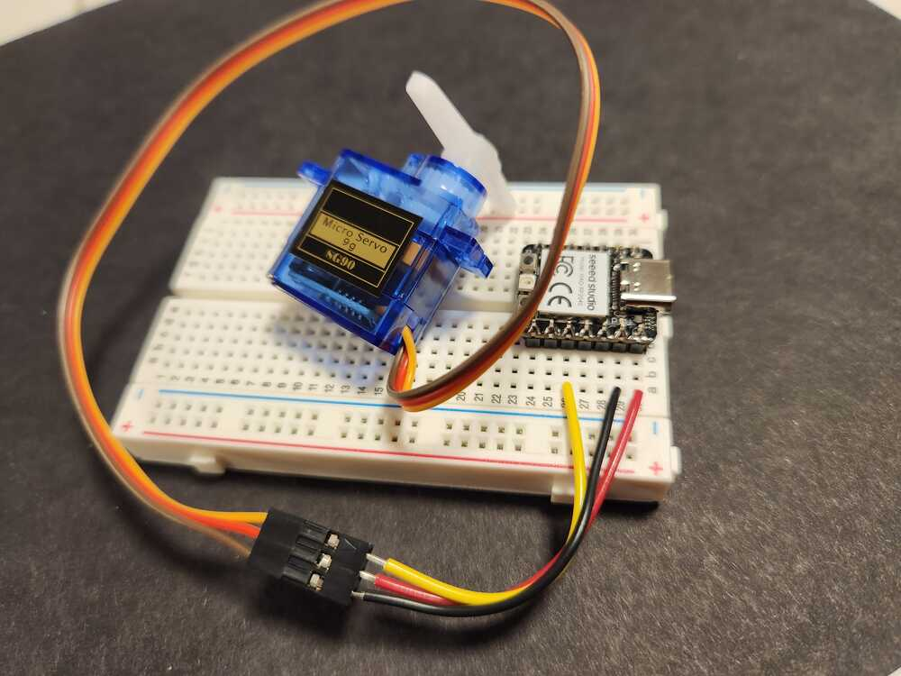

# Output device:  Servomotor.

These are small geared motors with their own controller.  they are controlled by a code that tells their controller where to send the motor arm.  They typically move between zero and 180 degrees.

These servomotors are powered by the 5V pin on the microcontroller.  The signals come from an output pin of the microcontroller.

To run a servomotor, you need code that sends the correct pulses to the motor.  This is done by the code in this directory called [servo.py](./code/servo.py).  You need to load it into your microcontroller's memory.  the other code examples call functions within that code to make the motor work.

  

<figure>
  
  <figcaption>Servomotor input wires.</figcaption>
</figure>

  

<figure>
  
  <figcaption>Servomotor on breadboard attached to ground, 5V, and an output pin.</figcaption>
</figure>

