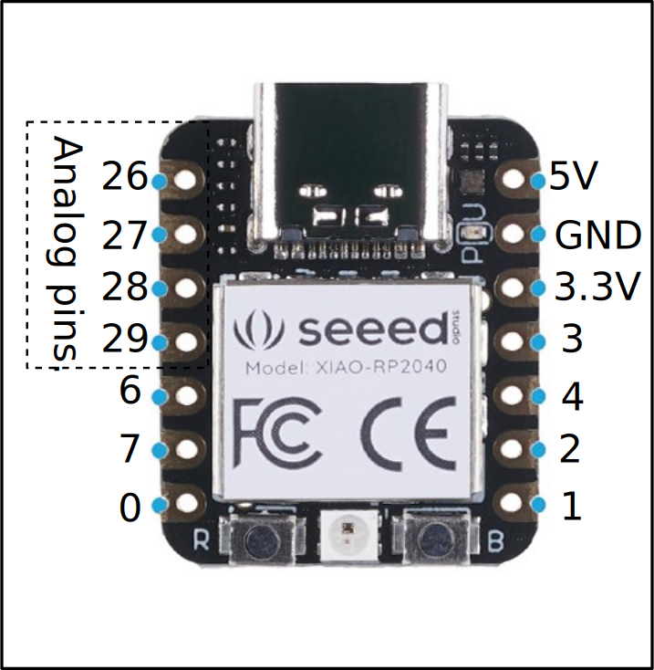
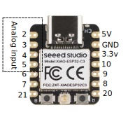

# intro_to_micropython
Introduction to micropython on the RP2040 and ESP32, particularly the xiao modules.  Pin names for using Micropython on the RP2040 module are show in the figure below:

<figure>
  
 </figure>

### Folders above have diagrams and code examples for:

* Input devices
    * button
    * light detection with a phototransistor
    * magnetic field measurement
    * potentiometer for rotation (dial input)
    * temperature sensing with a thermistor.

* Output devices
    * Buzzer
    * LED
    * Neopixel strip (RGB LEDs)
    * DC motor
    * Organic LED (OLED) display
    * Servomotor.
    

### Simple instructions for using Thonny to program.  [Good tutorial here.](https://randomnerdtutorials.com/getting-started-thonny-micropython-python-ide-esp32-esp8266/)
* Connect your device to Thonny.
* Put code in Thonny window.
* Edit as needed.
* Run code on the device using green arrow.
* Save code as main.py to run on reset.
* Save or open code on the computer.

### Resources for learning
* This repository. 
* [Rob's Intro to electronics.](https://roberthart56.github.io/SCFAB/SC_lab/Electronics/electronics_basics/electronic_basics.html)
* Tutorials and other resources as Adafruit.com, Sparkfun.com
* AI tools such as ChatGPT.
* [Micropython reference.](https://docs.micropython.org/en/latest/rp2/quickref.html)
* email Rob Hart at roberthart56@gmail.com
* [Spreadsheet inventory for the kit](https://docs.google.com/spreadsheets/d/1ea21Ol0HnfFcnW5KguXi43tg_k-Ri7uJ2SghusxsvjQ/edit?usp=sharing), in case you want to order parts for yourself.

### How does a breadboard work?

[Breadboard tutorial from Sparkfun](https://learn.sparkfun.com/tutorials/how-to-use-a-breadboard/all)

<figure>
  
 </figure>

### What about the ESP32?

<figure>
  
 </figure>

Included in the kit are a couple of ESP32C3 xiao modules.  These modules are loaded with the Micropython firmware and can be used in the same way as the rp2040 modules.  They have the ability to connect to wireless networks, to access the internet and other devices on the network, as well as the ability to communicate directly with another ESP32.  There are no examples in this repository yet, but you will find many examples on the internet, and many good tutorials.  

[A few more words about xiao modules and micropython](https://haystack-mtn.notion.site/Setting-up-simple-microcontroller-projects-Example-button-and-simple-LED-with-LiPo-battery-6196a7c8585649d7b8a7133133e4cf9e)

[Tutorial for installing micropython on a fresh ESP32](https://wiki.seeedstudio.com/XIAO_ESP32C3_MicroPython/)

