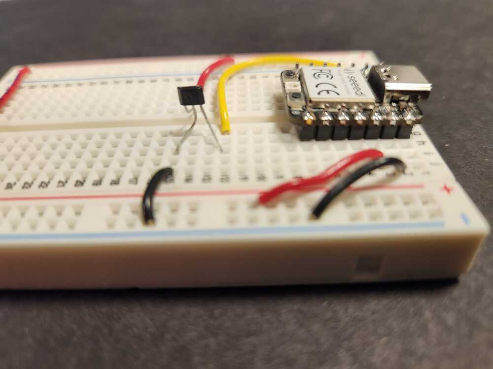

# Input Device:  Hall sensor for magnetic field detection.

A hall sensor outputs a voltage from 0 to 3.3V that corresponds to the magnetic field that is directed through its package.  See the data sheet for details: [link to datasheet](https://www.akm.com/content/dam/documents/products/magnetic-sensor/linear-hall-effect-ic/eq731l/eq731l-en-datasheet.pdf) 

Two pins of the sensor are attached to ground and to 3.3V.  The voltage of the third pin is read by one of the microcontroller pins that is capable of analog to digital conversion (ADC).  It reports voltages as numbers in the range 0 - 65536 (2 to the power 16).

  

<figure>
  
  <figcaption>Magnetic field detection circuit.</figcaption>
</figure>

<figure>
  
  <figcaption>Hall sensor, side view.</figcaption>
</figure>

  

<figure>
  
  <figcaption>Hall sensor on a breadboard attached to a pin of a microcontroller module. Top view. </figcaption>
</figure>

