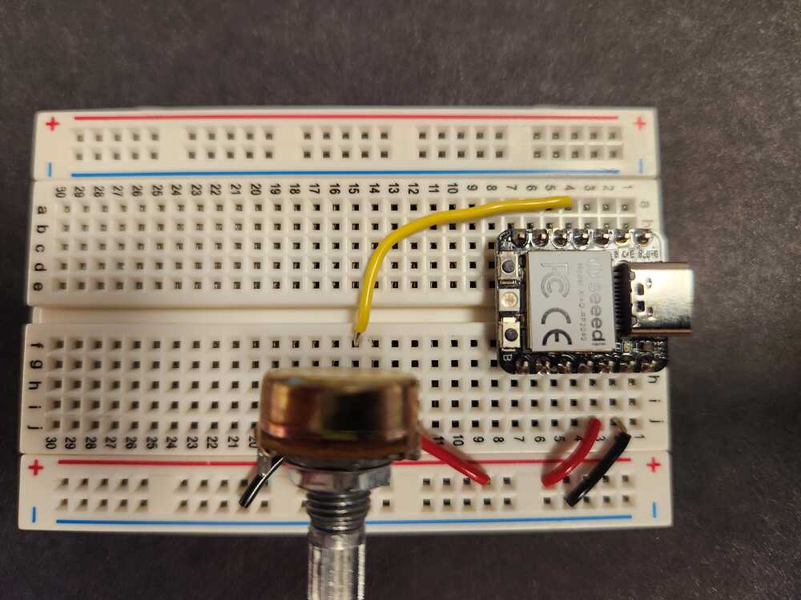

# Input Device to measure rotation:  Potentiometer.

A potentiometer puts out a voltage at its center contact that varies from low to high as the dial is turned.  The two outer contacts are connected to ground (zero volts) and to 3.3V in this example.

The voltage at the center contact (the 'wiper') is read by one of the microcontroller pins that is capable of analog to digital conversion (ADC).  It reports voltages as numbers in the range 0 - 65536 (2 to the power 16).

  

<figure>
  
  <figcaption>Potentiometer circuit.</figcaption>
</figure>

  

<figure>
  
  <figcaption>Potentiometer on a breadboard, side view.</figcaption>
</figure>

<figure>
  
  <figcaption>Potentiometer on a breadboard, top view, showing connections.</figcaption>
</figure>

