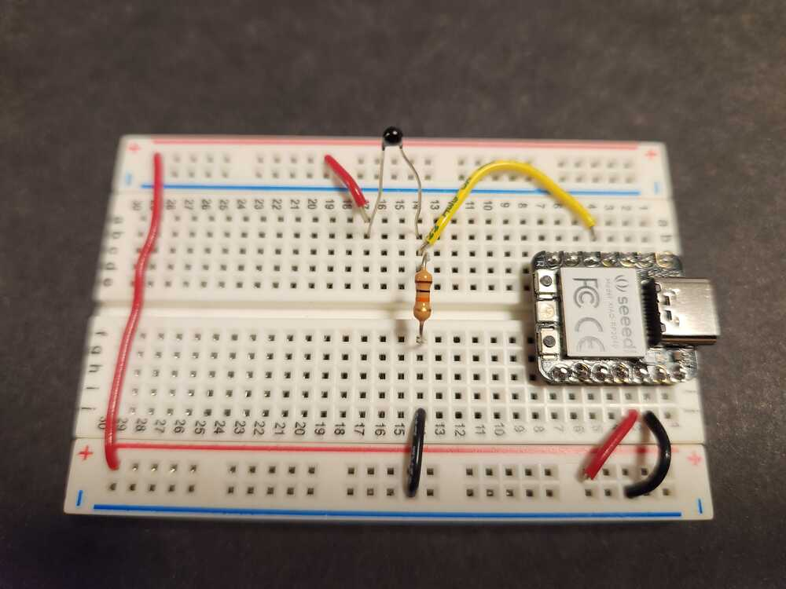

# Input Device to measure temperature:  Thermistor.

A thermistor is a temperature-dependent resistor.  It is attached in series to another resistor, a configuration called a voltage divider.  When its temperature changes, the voltage between the two resistors changes.

ADC.

  

<figure>
  
  <figcaption>Button circuit.</figcaption>
</figure>

  

<figure>
  
  <figcaption>Button on breadboard attached to a pin of a microcontroller module.</figcaption>
</figure>

